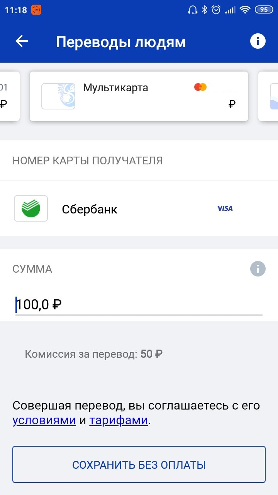
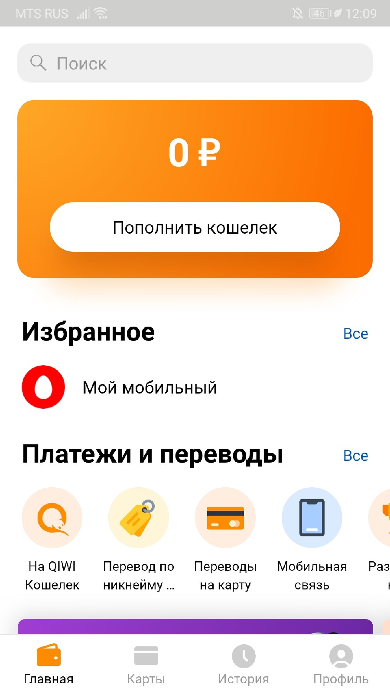
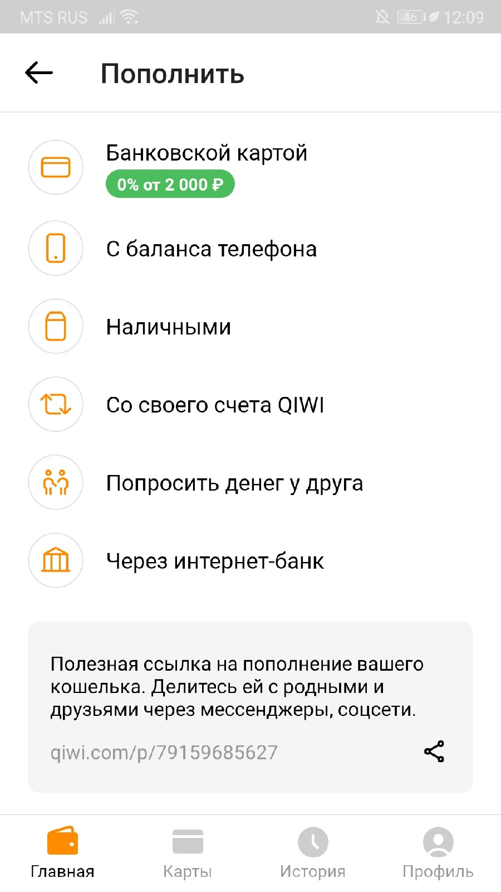

# Работу выполнили Морозов Денис и Криничный Дмитрий
# Выбранное направление
Для описания проекта было выбрано направление «Взгляд». Основная задача будет заключаться в отображении необходимой информации, возможности удобно и быстро осуществлять необходимые действия.

# Цель наблюдения
Целью наблюдения является выявить, насколько удобно людям совершать переводы между платежными системами, размер комиссий, а также узнать, сколько потребуется времени на совершение перевода. В данный момент пользователи сталкиваются с проблемой высокой комиссии при переводе «напрямую» (например, с ВТБ на Сбербанк), а также чтобы совершить перевод необходимо совершить множество действий.

# Основные параметры интервьюируемых:
1. Возраст.
2. Количество используемых платежных систем.
3. Частота перевода средств.
4. Трудоустроенность.

# Характеристика интервьюируемых
1. 21 год. Использует 2 платёжные системы. Часто переводит средства. Трудоустроен.
2. 21 год. Использует 2 платежные системы. 1-2 раза в день переводит средства. Безработный.
3. 21 год. Использует 3 платёжные системы. Один или несколько раз в месяц переводит средства. Безработный.
4. 21 год. Использует 3 платежные системы. Около 5 раз в месяц переводит средства. Трудоустроен.

# Наблюдения
Студент К.
Студент К. использует две платежные системы: ВТБ и Сбербанк Онлайн. 
В данном наблюдении студент столкнулся с проблемной высокой комиссии между переводами. Однажды ему потребовалось совершить перевод со своего счета ВТБ на счет другого человека, и уже при совершении транзакции студент К. увидел информацию о комиссии (Рисунок 1).

Рисунок 1 – Комиссия при переводе между ВТБ и Сбербанк.

Комиссия составила 50% от суммы перевода, что достаточно много. В данном случае у студента К. есть 4 варианта действий:
1.	Смириться с комиссией и перевести деньги. Но в данном случае будут потрачены нужные деньги, которые можно потратить на обед в столовой.
2.	Снять в банкомате наличные и отдать деньги при личной встрече.  В данном случае необходимо будет найти банкомат ВТБ, и, если банкомат на «зажует» карту, то снять наличные. Перечисленные действия займут слишком много времени.
3.	Не отдавать деньги. Просто не самый лучший вариант, в нем плохо все что есть.
4.	Совершить перевод с использованием «промежуточного» платёжного сервиса, например, через Qiwi. В данном случае размер комиссий сократится, но потребуется много времени для совершения перевода (с ВТБ на Qiwi, с Qiwi на Сбербанк), при этом потребуется вводить проверочные коды. К тому же, сложно в голове рассчитать сумму, которая дойдет до конечного получателя после всех комиссий.

Студент В.
Студент В. Использует 2 платежные системы: Qiwi и Сбербанк онлайн.
Студенту В. потребовалось совершить перевод на кошелек Qiwi, чтобы совершить покупку, для этого он использовал два приложения: отдельно приложение Qiwi и отдельно Сбербанк Онлайн.
Вначале ему пришлось открыть приложение Qiwi (Рисунок 2). Затем выбрать «Пополнить кошелек» (Рисунок 3) и выбрать «Банковской картой»,  для чего потребовалось заполнить реквизиты карты и выбрать сумму (приложение не разрешает сделать скриншот экрана, что с одной стороны логично, но с другой неудобно).

Рисунок 2 – Мобильное приложение Qiwi.

Рисунок 3 – Меню «Пополнить».

После совершения перевода, необходимо будет подтвердить перевод через Сбербанк, а именно дождаться, когда на телефон придет СМС-сообщение с кодом для перевода. Поскольку нет возможности автоматического заполнения поля для кода, необходимо запоминать/записывать код (что неудобно и часто непросто), и только после ввода кода из СМС перевод будет совершен.

Как можно увидеть, для того, чтобы перевести деньги на Qiwi, необходимо совершить множество действий, и это занимает достаточно много времени.

Чтобы решить данные проблемы, нами был предложен проект, который поможет избежать данных неудобств.

# Описание проекта
Предполагается реализация проекта в виде мобильного приложения. Приложение будет включать в себя информацию о различных электронных сбережениях пользователя, например, Сбербанк, Qiwi, ВТБ, Яндекс.Деньги и других. Помимо вывода информации, приложение позволит переводить сбережения с одного счета на другие, при этом будет выводиться информация о комиссии и альтернативные способы перевода, которые могут сократить комиссию: например, вместо прямого перевода с карты Сбербанка на карту ВТБ, перевести сумму сначала на кошелек Яндекс.Деньги. Помимо этого, при необходимости, на рабочем столе будет задействован виджет, который отображает общее количество сбережений со всех карт банков и электронных кошельков.

# Аналоги
1. Мобильное приложение «Кошелёк. Скидочные и бонусные карты»
Приложение позволяет сохранить реквизиты карт любых банков — Альфа-Банк, Сбербанк, Тинькофф, QIWI, Русский Стандарт, ВТБ, Кукуруза, Рокетбанк, «Открытие», Банк Москвы, Хоум Кредит и других.

2. Платёжная система «Яндекс.Касса»
Сервис для бизнеса — приём платежей, выплаты клиентам, платёжные решения для бизнеса. Самый популярный платёжный агрегатор по версии MARC.

3. Онлайн-управление личными деньгами «Дзен-мани»
Сервис для планирования и учета расходов и доходов, имеет возможность составления бюджета и подбора наиболее выгодных вкладов.
# План интервью. Вопросы

1.	Какими электронными платежными системами вы пользуетесь?
2.	У вас есть сбережения на электронных кошельках?
3.	Когда в последний раз вы были в банке?
4.	Приходилось ли вам совершать переводы с одной платежной системы на другую, например, со Сбербанка на ВТБ и другие? 
5.	Были моменты, когда из-за высокой комиссии вы не решались переводить деньги?
6.	Какими функциями вы пользуетесь в мобильных банках?
7.	Было бы вам удобно видеть всю информацию о своих сбережениях в одном приложении? 
8.	Какую из платежных систем вы считаете самой удобной? И почему? 
9.	Сколько у вас по времени занимает перевод с одной платежной системы на другую? 
10.	Какая платежная систему у вас является основной? Почему? 
11.	При каких условиях вы бы согласились сменить вашу основную платежную систему на другую?

# Результаты интервью

Номер вопроса  | Студент К. | Студент В. | Студент У. | Студент П. 
--- | --- | --- | --- |--- 
1 | Сбербанк онлайн и ВТБ онлайн | Сбербанк онлайн, Qiwi | Qiwi, WebMoney, Приват 24 | Сбербанк онлайн, Тинькофф, Qiwi
2 | Да | Да | Да | Да
3 | Сегодня | 4 месяца назад | 1 месяц назад | 6 месяцев назад
4 | Да | Да | Нет | Да
5 | Да | Нет | Да | Нет
6 | В основном перевод и мониторинг сбережений + расходы | Накопление и хранение денежных средств | Регулярные платежи | Переводы и платежи 
7 | Да | Да | Да | Да  
8 |  | Киви, потому что интерфейс прост и понятен | Приват онлайн, поскольку основные финансы находятся в нём | Alipay, потому что имеет возможность оплаты через QR-коды, и, в целом, удобный интерфейс 
9 |  | При хорошей связи весь процесс занимает около минуты | Около одной-двух минут, зависит от того, как быстро придет СМС |  Около 30 секунд
10 |  | Киви, потому что предлагает самую низкую комиссию на переводы с карт Сбербанка, имеет удобный и простой интерфейс | Приват онлайн, потому как через него поступают средства | Сбербанк, т. к. за обслуживание карты платит университет  
11 |  | При возможности совершения максимально быстрых переводов с карты на платежную систему, уменьшения комиссии, начислении кэшбэка за оплату товаров и услуг | Если бы она имела большую интеграцию в повседневную жизнь. К примеру, везде была бы возможность совершить оплату с её помощью (например, в общественном транспорте) | Если новая система предложит более выгодные условия 

# Анализ результатов интервью

Проанализируем полученные результаты.
1.	Большинство людей на сегодняшний день не ограничивается одним или двумя электронными кошельками или банковскими картами.
2.	Высокие комиссии являются большой проблемой при переводе денег между разными банками или электронными кошельками.
3.	У трудоустроенных людей, как правило, больше карт различных банков и выше потребность в переводах.
4.	Повсеместное распространение электронных кошельков и онлайн-приложений банков позволило сократить количество визитов в банк, но не отменило их.
5.	Существует потребность в объединении информации обо всех сбережениях в каком-то «одном месте».
6.	Если одному из опрошенных придется выбирать, каким способом передать деньги другому человеку или организации (наличными при личной встрече или переводом), то он скорее предпочел бы перевод, поскольку он позволяет переводить любую некруглую сумму денег (например, 179 рублей), а так же позволяет это делать дистанционно.

